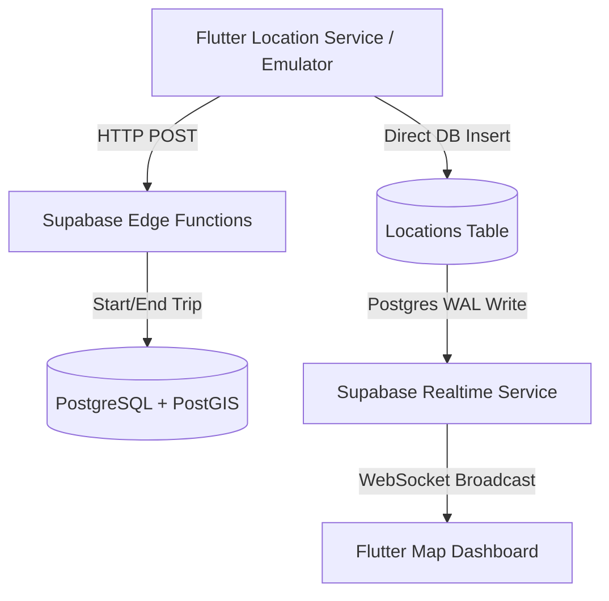

# System Architecture - GPS Live Tracker (Supabase Stack)

This document provides a technical overview of the architecture, component layers, and live streaming mechanics used in the GPS Live Tracker.

## 🗼 System Topology

---

## 🧱 Architectural Components

### 1. Client App (Flutter)
- **State Management (Provider)**: Coordinates UI events and maintains lists of devices, trips, active trackers, and location routes.
- **Map View (flutter_map)**: Renders vector tiles from OpenStreetMap (OSM) without requiring paid API keys.
- **Location Ingestion / Simulator**: Tracks current GPS using the `geolocator` plugin or broadcasts a simulated waypoint stream at **30-second intervals** to test tracking stability.

### 2. Backend Ecosystem (Supabase)
- **Postgres Database**: Storage of all entities using geographical indexes.
- **Realtime Engine**: Broadcasts database inserts dynamically over WebSockets using PostgreSQL's replication log.
- **Supabase Edge Functions (Deno)**:
  - `create_trip`: Performs verification and initiates a tracking run.
  - `end_trip`: Marks a run complete and computes final telemetry aggregates.

### 3. API & Communications Layer
- **REST Protocol**: For non-streaming requests (auth, history lists, trip setup).
- **WebSockets (Supabase Realtime)**: Pushes single coordinate packets directly to clients in real-time.

---

## 🔄 Real-time Coordinate Streaming Flow

1. **Trigger**: Every 30 seconds, the device gathers location data (simulated or actual) and issues a database insert to the `locations` table.
2. **Replication**: The Postgres Write-Ahead Log (WAL) captures the new record.
3. **Broadcast**: Supabase Realtime identifies the change and publishes the `INSERT` payload over the channel:
   `realtime:public:locations:trip_id=eq.<trip_id>`
4. **Ingestion**: The Flutter frontend receives the coordinates, recalculates the path array, and redraws the Polyline dynamically.
