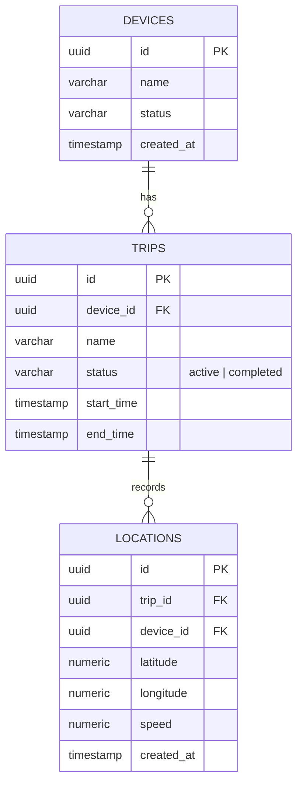

# Database Design

This document details the PostgreSQL schema, indexes, constraints, and Row Level Security (RLS) policies implemented in Supabase for the GPS Live Tracker.

## 🗄️ Relational Schema Design



---

## 🏗️ Tables Schema

### 1. `devices`
Represents physical trackers or emulators reporting status.

| Column | Type | Constraints | Description |
| :--- | :--- | :--- | :--- |
| `id` | `UUID` | `PRIMARY KEY, DEFAULT gen_random_uuid()` | Unique device identifier |
| `name` | `VARCHAR` | `NOT NULL` | Readable label for device |
| `status` | `VARCHAR` | `DEFAULT 'offline'` | Online, offline, tracking |
| `created_at` | `TIMESTAMPTZ` | `DEFAULT now()` | Creation timestamp |

### 2. `trips`
Grouping of consecutive coordinate points into a single journey.

| Column | Type | Constraints | Description |
| :--- | :--- | :--- | :--- |
| `id` | `UUID` | `PRIMARY KEY, DEFAULT gen_random_uuid()` | Unique trip ID |
| `device_id` | `UUID` | `FOREIGN KEY REFERENCES devices(id) ON DELETE CASCADE` | Device tracking this trip |
| `name` | `VARCHAR` | `NOT NULL` | Description of trip (e.g. Delivery Route 5) |
| `status` | `VARCHAR` | `CHECK (status IN ('active', 'completed'))` | Trip state |
| `start_time` | `TIMESTAMPTZ` | `DEFAULT now()` | Time trip was started |
| `end_time` | `TIMESTAMPTZ` | | Time trip concluded |

### 3. `locations`
Time-series spatial records containing lat-long points.

| Column | Type | Constraints | Description |
| :--- | :--- | :--- | :--- |
| `id` | `UUID` | `PRIMARY KEY, DEFAULT gen_random_uuid()` | Unique log ID |
| `trip_id` | `UUID` | `FOREIGN KEY REFERENCES trips(id) ON DELETE CASCADE` | Associated trip ID |
| `device_id` | `UUID` | `FOREIGN KEY REFERENCES devices(id) ON DELETE CASCADE` | Reporting device |
| `latitude` | `NUMERIC(9,6)` | `NOT NULL` | GPS latitude (-90 to 90) |
| `longitude` | `NUMERIC(9,6)` | `NOT NULL` | GPS longitude (-180 to 180) |
| `speed` | `NUMERIC` | `DEFAULT 0` | Speed in m/s |
| `created_at` | `TIMESTAMPTZ` | `DEFAULT now()` | Capture timestamp |

---

## ⚡ Database Performance & Optimization

### Core Indexes
To query coordinates quickly during realtime feeds and route histories:

1. **Locations Time-series Index**:
   ```sql
   CREATE INDEX idx_locations_trip_time ON locations(trip_id, created_at DESC);
   ```
   *Optimizes retrieval of path arrays sorted by newest point first.*

2. **Geospatial Indexes (Optional for PostGIS)**:
   ```sql
   CREATE INDEX idx_locations_geom ON locations USING gist(st_setsrid(st_makepoint(longitude, latitude), 4326));
   ```
   *Optimizes boundary evaluations, geofence collision detection, and radial distance queries.*

---

## 🛡️ Security: Row Level Security (RLS)

All tables have RLS enabled by default to prevent unauthorized tracking reads or device counterfeiting:

- **Anonymous Read**: Authenticated app clients can view active devices and public location paths.
- **Write Restriction**: Location points and trip states can only be edited by matching device API tokens or authenticated admin functions.
